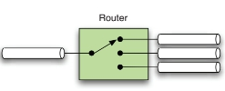

# spring-integration-samples

## General concepts

### Messages

A message is a unit of information that can be passed between different components, called message endpoints.

Each message contains of headers and payload. The header contains data that's relevant to the messaging system.
The payload contains the actual data to be accessed or processed by the receiver.

### Message channels

The message channel is the connection between multiple endpoints. The channel implementation manages the details of how and where a message is delivered but shouldn't need to interact with the payload of a message.
Most important characteristic of any channel is that it logically decouples producers from consumers.

Channels may be classified to a single endpoint(point-to-point) or publish-subscribe.

Channels can be categorized based on two dimensions:
type of handoff(synchronous and asynchronous), type of delivery(point-to-point and publish-subscribe)

### Message endpoints

Message endpoints are the components that actually do something with the message.
This can be routing, splitting whatever.

Message endpoints basically provide the connections between functional services and the messaging framework.

#### Channel adapter

A _Channel Adapter_ connects an application to the messaging system. Usually channel adapter is placed at the beginning and the end of unidirectional flow.

#### Messaging gateway

_Messaging gateway_ is a connection that's specific to bidirectional messaging. If an incoming request needs to be services by multiple threads but the invoker to remain unaware of the messaging system, an inbound gateway provides the solution.
On the outbound side, an incoming message can be used in a synchronous invocation, and the result is sent on the reply channel.

#### Service activator

_Service activator_ is a component that invokes a service based on a incoming message and sends an outbound message based on the return value of this service invocation.

#### Router

_Router_ determines the next channel a message should be sent to based on the incoming message.
This can be useful to send messages with different payloads to different consumers.

#### Splitter

A _Splitter_ receives one message and splits it into multiple messages that are sent to its output channel.

#### Aggregator

A _Aggregator_ waits for a group of correlated messages and merges them together when the group is complete. The correlation of the messages typically is based on a correlation ID, and the completion is typically related to the size of the group.

